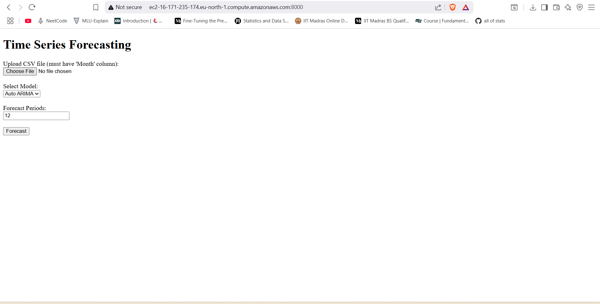
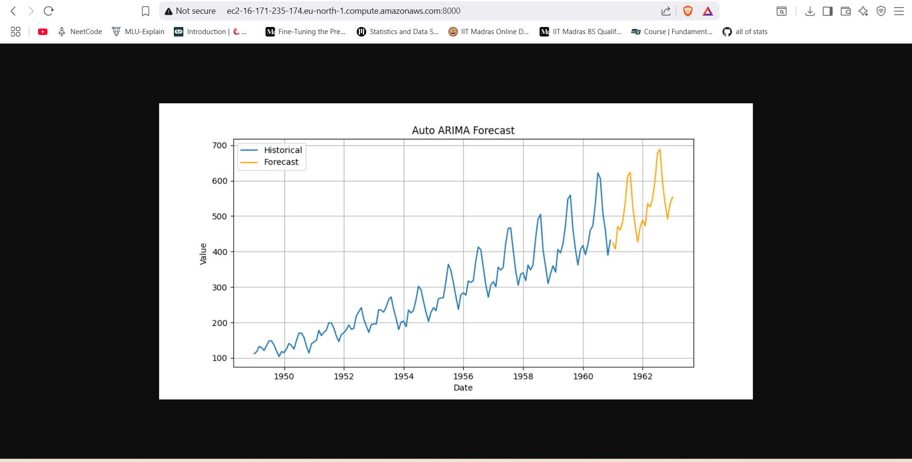
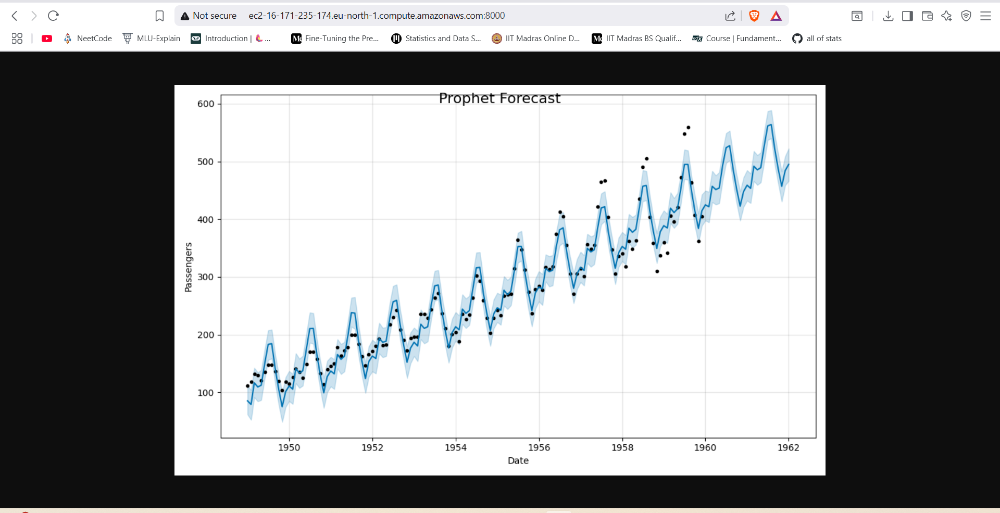

# 📈 Time Series Forecasting Web App

A **production-grade time series forecasting web application** that allows users to upload their own CSV files, select forecasting models, and generate predictions for future periods.  
Built for scalability, deployed on **AWS EC2** with **CI/CD pipelines** for seamless updates.  

---

## 🚀 Features

- 📂 Upload custom CSV datasets (must include a `Month` column)  
- 📊 Choose between **Auto ARIMA** and **Prophet** models for forecasting  
- ⏩ Forecast future values for a user-defined number of periods  
- 🌐 Simple and intuitive **HTML-based frontend**  
- ☁️ **Production-grade AWS EC2 deployment** with CI/CD pipelines  
- 🐳 Dockerized for easy containerization and deployment  

---

## 🛠️ Tech Stack

| Layer          | Technology                |
|----------------|--------------------------|
| Frontend       | HTML, CSS                |
| Backend        | Flask (Python)           |
| Forecasting    | Auto ARIMA, Prophet      |
| Deployment     | Docker, AWS EC2          |
| CI/CD          | GitHub Actions           |

---

## 🖥️ How It Works

1. **Upload** a CSV file containing a `Month` column.  
2. **Select** your preferred forecasting model: Auto ARIMA or Prophet.  
3. **Enter** the number of periods to forecast.  
4. **View** interactive plots and download results.  

---

###  Project Demo
| Interface | Prediction AutoArima | Prediction Prophet |
|-----------|-------------------|-----------------------|
|  |  |  |

---
## ⚙️ Running Locally

```bash
# Clone the repository
git clone https://github.com/kartheek2003/time-series-forecast.git
cd time-series-forecast

# Create virtual environment and install dependencies
python -m venv venv
source venv/bin/activate   # On Windows: venv\Scripts\activate
pip install -r requirements.txt

# Run the app
python app.py

```

> Access the web app at http://127.0.0.1:8000
---

## ☁️ AWS Deployment

- Hosted on **AWS EC2** with **CI/CD pipelines** configured via **GitHub Actions**  
- Automatic **build, test, and deploy** on every push to the `main` branch  
- **Docker container** ensures consistent environment setup

## 🔮 Future Improvements

- Add support for additional models like **LSTM**  
- Enable **dynamic hyperparameter tuning** for better accuracy  
- Expand **CI/CD workflows** for blue-green deployments  
- Enhance visualizations with **Plotly/Dash**  

## 🤝 Contributing  

Contributions are welcome!  
Feel free to **fork** this repository and create a **pull request** with your improvements.  

## ✨ Author  

**Kartheek Akkabathula**  
[GitHub](https://github.com/kartheek2003)  


